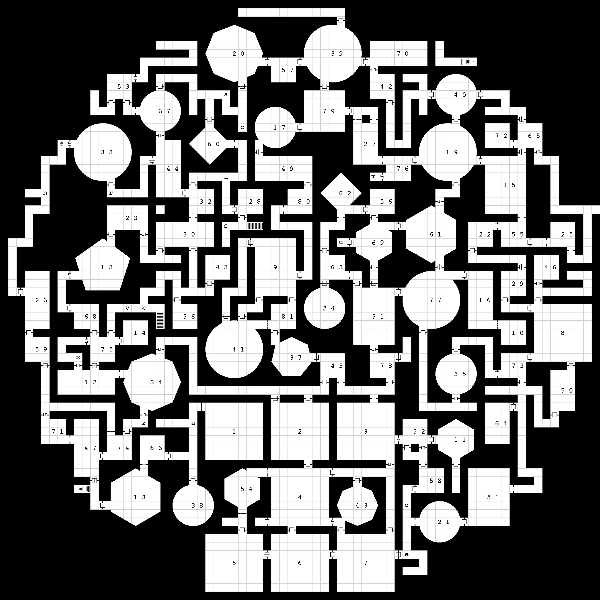

# Donjon Regen

Recreate [donjon.bin.sh](https://donjon.bin.sh/5e/dungeon/) dungeon-generator
output from the exported JSON file — GM map PNG, player map PNG, HTML, TSV,
CSV — using Python + Pillow. Includes a PySide6 GUI that doubles as an
in-place editor (draw corridors, create / reshape / delete rooms, resize the
canvas, mirror rooms across an axis).



## Features

- **Faithful re-render** of donjon's GM and player maps from the exported
  JSON: labeled rooms, corridor-feature letters, polymorph (polygon / circle)
  rooms with crisp pixel-aligned edges, six door types with procedurally drawn
  symbols (no resampling, no anti-aliasing), and stair-up / stair-down
  hatching.
- **HTML page** — embedded map with clickable image-map areas + per-room
  detail tables.
- **TSV / CSV grid** — TSV is byte-identical to donjon's reference; CSV is the
  same data with comma delimiters.
- **PySide6 GUI** — zoom / pan viewer with a structured Room Editor and a
  toolbar that turns the same view into an editor (corridor brush, room
  rectangle, eraser, canvas resize, mirror rooms).
- **User-settable render scale** (`-s/--scale 1..8`) — default 2× makes
  polygon edges, door symbols, and labels noticeably sharper than donjon's
  reference output at the cost of 4× pixel area.

## Install

```bash
uv sync
```

Requires Python ≥ 3.14. Dependencies (Pillow ≥ 12, NumPy ≥ 2.4, PySide6 ≥ 6.8)
are managed by `uv` in a local `.venv`.

## Usage

### CLI

```bash
# Render to PNG / HTML / TSV / CSV (default output dir: renders/)
uv run python main.py path/to/dungeon.json

# Override the output directory and the render scale
uv run python main.py path/to/dungeon.json -o ./out -s 4

# Launch the GUI from the CLI entry point
uv run python main.py --gui
```

### GUI

Open a donjon JSON via the toolbar (**Open JSON…**), then click any cell on
the map for details. Saved output (**Save Outputs…**) runs on a background
thread so the UI stays responsive.

#### Viewing

| Action               | Mapping                                                 |
|----------------------|---------------------------------------------------------|
| Mouse wheel          | Zoom (anchored under cursor)                            |
| Middle-button drag   | Pan                                                     |
| Left-click           | Open details / room editor for the cell                 |
| Ctrl + 0             | Fit to window                                           |
| Scale spinbox        | Change the render-scale multiplier (1–8, default 2)     |

#### Editing tools

The toolbar's tool group switches the left-click behavior:

| Tool       | Behavior                                                                |
|------------|-------------------------------------------------------------------------|
| Select     | Open cell details (default — preserves the original viewer behavior).   |
| Corridor   | Click or drag to paint corridor tiles. Refuses to overwrite room cells. |
| Room       | Click-and-drag to draw a rectangle; on release, a shape dialog appears (Rectangle / Polygon-N / Circle — polymorph options unlock only for square bbox). |
| Eraser     | Click or drag to clear tiles (resets each cell to void).                |

#### Room editor (open by selecting any room cell)

- **Summary** line + derived **Inhabited** display.
- Per-detail-section list editors (monsters, hidden treasure, …) with
  separator-aware add buttons.
- **Doors** rows with a type combo (arch / door / locked / trapped / secret /
  portcullis) and a type-dependent extra field (trap / hint).
- **Geometry** section: shape combo (Rectangle / Polygon / Circle), Polygon-N
  spinbox, and four signed perimeter Δ spinboxes (N / S / W / E). Apply runs
  resize first then reshape, so a non-square room can be grown to square *and*
  converted to polygon/circle in a single Apply.
- **Apply Changes** flushes everything to the in-memory dungeon and
  re-renders the map when doors or geometry changed.
- **Delete Room** removes the room, clears its cells, and strips door-type
  bits from the room's door cells.

#### Structural actions

- **Resize Canvas…** — 4-direction signed deltas (N / S / W / E in cells).
  Positive grows that edge, negative shrinks it. Shrinking is allowed: if any
  rooms or stairs would fall outside the new bounds the dialog confirms
  before discarding them.
- **Mirror Rooms…** — pick axis (horizontal / vertical), source side, and
  pivot index. Overwrite mode: destination-side rooms overlapping the
  mirrored region are deleted first. Corridors and stairs are NOT mirrored;
  rooms straddling the pivot are skipped.

## Output formats

| File                                  | Description                                       |
|---------------------------------------|---------------------------------------------------|
| `<name> (cols × rows).png`            | GM map — labeled rooms + corridor features        |
| `<name> (player, cols × rows).png`    | Player map — same geometry, no labels             |
| `<name>.html`                         | Embedded map with image-map areas + detail tables |
| `<name>.tsv`                          | Tab-separated grid (byte-identical to donjon)     |
| `<name>.csv`                          | Comma-separated version of the same grid          |

## Project layout

```
main.py            # CLI entry point (also launches the GUI with --gui)
generate.py        # Shared generation pipeline used by CLI and GUI
gui.py             # PySide6 GUI: viewer + editor + structural ops
cells.py           # Cell-bitmask constants & helpers
dungeon_ops.py     # Pure mutations on the in-memory dungeon dict
renderer.py        # PIL-based GM / player map renderer
html_gen.py        # HTML generator
table_gen.py       # TSV + CSV writer (shared)
gen_assets.py      # Procedural door / stair symbol generator
assets/            # 19×19 reference symbol PNGs (regenerated by gen_assets.py)
docs/              # Documentation assets (example map screenshot)
```

`CLAUDE.md` has the full notes on the cell-bitmask encoding, the cells-array
padding offset, the rendering pipeline, and the `dungeon_ops` invariants —
useful if you want to extend the editor or integrate with another tool.
